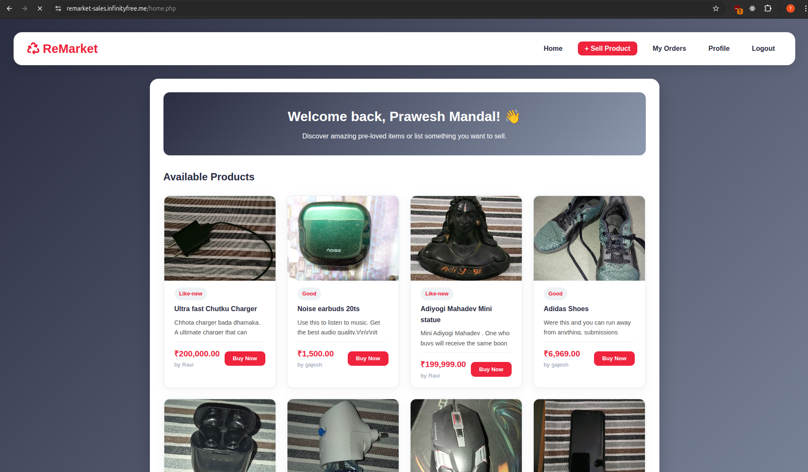

<p align="center">
  
</p>

<h1 align="center">
  <span style="color: #EF233C;">ReMarket</span>
</h1>

<p align="center">
  A platform where you can <b>buy and sell pre-owned products</b> easily and securely.<br>
  Built using <b>PHP</b>, <b>MySQL</b>, and <b>HTML/CSS</b>.
</p>

---

<h1 align="center">
  <span style="color: #EF233C; font-size:14px;">Preview</span>
</h1>

<p align="center">
  
</p>

---

> ## 🌟 Features

- User authentication (signup/login using sessions)
- Sell products with images
- Browse and buy listed products
- Order management and delivery confirmation
- User profiles and item listings

> ## Project structure

- `assets/css/style.css` — main stylesheet
- `buy_product.php` — product purchase logic
- `config.php` — database configuration and helpers
- `confirm_delivery.php` — delivery confirmation
- `database.sql` — database schema (create/import)
- `home.php` — main/home page
- `index.php` — landing page
- `login.php`, `signup.php`, `logout.php` — auth
- `orders.php` — order listing and management
- `profile.php` — user profile
- `sell_product.php` — product upload form
- `uploads/` — uploaded product images
---
> ## Default Login
- Username : prawesh12
- Password : 123@abcdefghi
---
> ## ⚙️ Installation and setup

1. Clone the repo:

```bash
git clone https://github.com/prawesh12/remarket.git
cd remarket
```

2. Create and import the database

Using `mysql` CLI:

```sql
CREATE DATABASE remarket;
USE remarket;
SOURCE database.sql;
```

Or import `database.sql` via phpMyAdmin.

3. Configure the database connection

Open `config.php` and update the DB constants to match your environment. Example local settings:

```php
// config.php (example local settings)
define('DB_HOST', 'localhost');
define('DB_USER', 'root');
define('DB_PASS', '');
define('DB_NAME', 'remarket');
```

If you use a remote host (e.g. InfinityFree) keep in mind DNS/hostname propagation may take time — use the hostname provided by your host control panel.

4. Deploy to your web server

Place the project folder into your web server document root:

- XAMPP: `htdocs/remarket`
- WAMP: `www/remarket`
- LAMP: `/var/www/html/remarket`

Start Apache and MySQL, then open:

```
http://localhost/remarket/
```

> ## Requirements

- PHP 7.4+ with mysqli enabled
- MySQL
- Apache (or a local PHP server)

> ## Notes

- For development you can use a local MySQL server to avoid remote-host DNS issues (e.g. InfinityFree). Keep production credentials out of version control.
- Uploaded images are stored in `uploads/`. Ensure this folder is writable by the web server.

> ## License

MIT — feel free to use and modify for learning or projects.

---

> ## 👨‍💻 Contributors

| Name            | Website                                                              |
| --------------- | -------------------------------------------------------------------- |
| Ravi Kumar Sah  | [ravikumarsah07.github.io](https://ravikumarsah07.github.io/Portfolio/) |
| Ankit Chaudhary | [aka-ank.github.io](https://aka-ank.github.io/Portfolio/)               |
| Prawesh Mandal  | [prawesh.me](https://prawesh.me)                                        |

---
